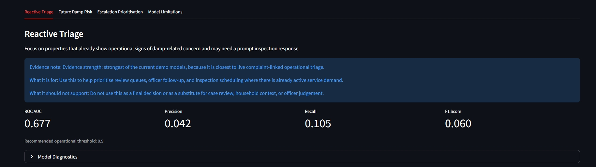
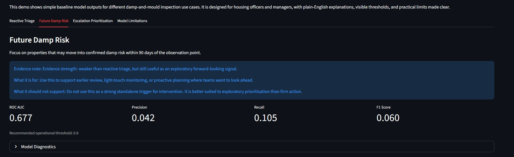
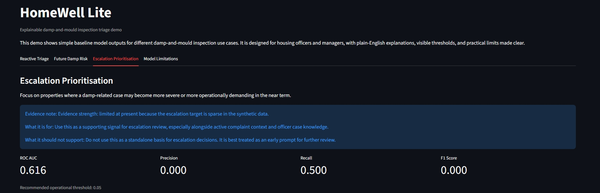
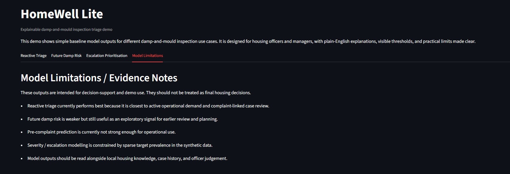

## HomeWell Lite – Damp & Mould Risk Prediction Prototype

🚧 Prototype — built to explore decision-support, not production deployment

## Overview

HomeWell Lite is a predictive analytics prototype designed to support early identification of damp and mould risks in social housing.

The goal is to move from reactive complaint handling to proactive risk-based intervention.

## Problem

Social housing providers often respond to damp and mould issues only after tenant complaints.

This reactive approach:

* Increases repair costs
* Impacts tenant health
* Creates regulatory and reputational risk

## Approach

This prototype uses machine learning models to:

* Predict future damp/mould risk scores for properties
* Prioritise inspections based on risk
* Provide explainability for decision-making

## Key Features

* Reactive Risk Triage (current cases)
* Future Risk Prediction (proactive identification)
* Explainable outputs (feature importance/drivers)
* Simple dashboard interface (Streamlit)

## Demo Screenshots

### Reactive Triage

### Future Damp Risk

### Escalation Prioritisation

### Model Limitations

## Tech Stack

* Python
* Scikit-learn
* Pandas / NumPy
* Streamlit

## Limitations

* Synthetic/limited dataset
* Not production-hardened
* No real-time data integration

## Positioning

This is not a full housing management system.

It is a **decision-support layer** designed to sit upstream of inspections, repairs, and capital planning.

## Author

Victor Adewale Adesope
Founder, Stratise AI Labs Ltd
